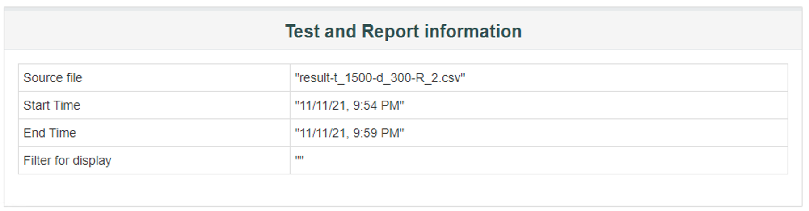
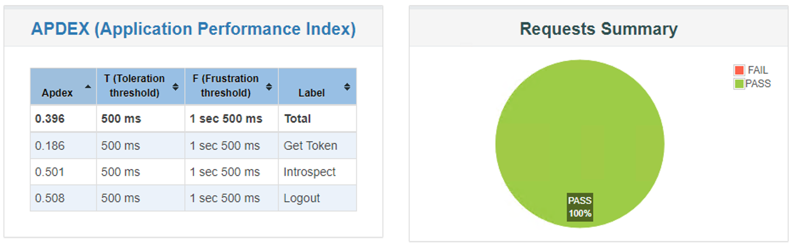
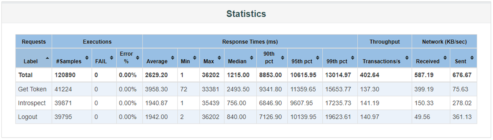
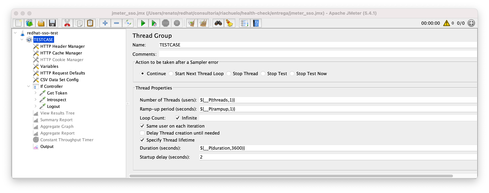
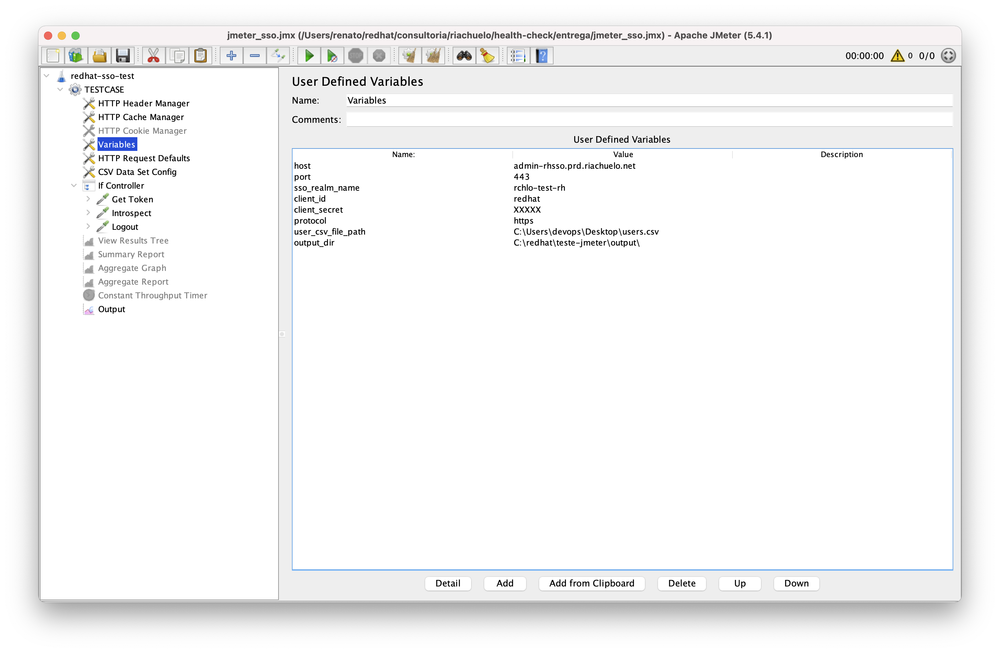

# Conceitos

* **Number of Threads (users) -** quantos usuários simultâneos estamos simulando;
* **Ramp-up period (seconds)** - quanto tempo esperar entre cada usuário (*Thread*);
* **Duration (seconds)** - para controlar a duração de cada *Thread*.
* **Loop Count:** quantas iterações serão executadas do cenário de teste. Foi usado a opção *infinite* com isso o delimitador passou a ser o tempo
* **Startup delay (seconds)** - quantos segundos para começar


# Setup JVM

> Obtido com `jinfo JAVA_PID`

```shell
VM Flags:
-XX:CICompilerCount=4 -XX:CompressedClassSpaceSize=528482304 -XX:ConcGCThreads=2 -XX:+ExplicitGCInvokesConcurrent -XX:G1ConcRefinementThreads=8 -XX:G1HeapRegionSize=4194304 -XX:GCDrainStackTargetSize=64 -XX:+HeapDumpOnOutOfMemoryError -XX:HeapDumpPath=/tmp/ -XX:InitialHeapSize=12452888576 -XX:InitialRAMPercentage=75.000000 -XX:MarkStackSize=4194304 -XX:MaxGCPauseMillis=500 -XX:MaxHeapSize=12452888576 -XX:MaxMetaspaceSize=536870912 -XX:MaxNewSize=7470055424 -XX:MaxRAMPercentage=75.000000 -XX:MetaspaceSize=134217728 -XX:MinHeapDeltaBytes=4194304 -XX:NonNMethodCodeHeapSize=5836300 -XX:NonProfiledCodeHeapSize=122910970 -XX:ProfiledCodeHeapSize=122910970 -XX:ReservedCodeCacheSize=251658240 -XX:+SegmentedCodeCache -XX:+UseCompressedClassPointers -XX:+UseCompressedOops -XX:+UseG1GC -XX:+UseLargePages

VM Arguments:
jvm_args: -D[Standalone] -XX:InitialRAMPercentage=75 -XX:MaxRAMPercentage=75 -XX:+UseG1GC -XX:+ExplicitGCInvokesConcurrent -XX:MaxGCPauseMillis=500 -XX:+UseLargePages -XX:MetaspaceSize=128M -XX:MaxMetaspaceSize=512m -Djava.net.preferIPv4Stack=true -Djboss.modules.system.pkgs=org.jboss.byteman -Djava.awt.headless=true -Xlog:gc*,safepoint=info:file=/var/lib/rh-sso-7.5/standalone/log/gc.log:time,uptime:filecount=10,filesize=20M -XX:+HeapDumpOnOutOfMemoryError -XX:HeapDumpPath=/tmp/ --add-exports=java.base/sun.nio.ch=ALL-UNNAMED --add-exports=jdk.unsupported/sun.misc=ALL-UNNAMED --add-exports=jdk.unsupported/sun.reflect=ALL-UNNAMED -Dorg.jboss.boot.log.file=/var/lib/rh-sso-7.5/standalone/log/server.log -Dlogging.configuration=file:/var/lib/rh-sso-7.5/standalone/configuration/logging.properties -agentpath:/opt/dynatrace/oneagent/agent/bin/1.227.148.20211102-135317/linux-x86-64/liboneagentloader.so=loglevelcon=none,datastorage=/var/lib/dynatrace/oneagent/datastorage,logdir=/var/log/dynatrace/oneagent
java_command: /var/lib/rh-sso-7.5/jboss-modules.jar -mp /var/lib/rh-sso-7.5/modules org.jboss.as.standalone -Djboss.home.dir=/var/lib/rh-sso-7.5 -Djboss.server.base.dir=/var/lib/rh-sso-7.5/standalone -c standalone-ha.xml -Djboss.http.port=8080 -Djboss.https.port=8443 -Djboss.jgroups.azure_ping.storage_account_name=XXX -Djboss.jgroups.azure_ping.storage_access_key=XXX -Djboss.jgroups.azure_ping.container=XXX -Djboss.node.name=XXX000022 -Dkeycloak.profile.feature.admin_fine_grained_authz=enabled -Dkeycloak.profile.feature.token_exchange=enabled -Dkeycloak.profile.feature.web_authn=enabled -Dkeycloak.profile.feature.scripts=enabled -Dkeycloak.profile.feature.upload_scripts=enabled -Djboss.site.name=XXXX -bmanagement 0.0.0.0 -bprivate 172.29.232.137 -b 0.0.0.0
java_class_path (initial): /var/lib/rh-sso-7.5/jboss-modules.jar
Launcher Type: SUN_STANDARD
```


# Teste de Carga

### Configuração

```shell
# ajustar JVM
set HEAP=-Xms7g -Xmx7g -XX:MaxMetaspaceSize=512m
#set HEAP="-XX:InitialRAMPercentage=80.0 -XX:MaxRAMPercentage=80.0"
set JVM_ARGS="-Dnashorn.args=--no-deprecation-warning"
```

### Execução de Cenários

> Formato de saída do relatório: `${output_dir}result-t_${__P(threads)}-d_${__P(duration)}-R_${__P(rampup)}.csv`

```shell
jmeter -n -t jmeter_sso.jmx -Jthreads=1000 -Jduration=300 -Jrampup=2
jmeter -n -t jmeter_sso.jmx -Jthreads=1000 -Jduration=1800 -Jrampup=2

# Aqui simula 1500 usuários, em 5 min, com uma espera de 2 segundos entre cada usuário
jmeter -n -t jmeter_sso.jmx -Jthreads=1500 -Jduration=300 -Jrampup=2
# Aqui simula 1500 usuários, em 30 min, com uma espera de 2 segundos entre cada usuário
jmeter -n -t jmeter_sso.jmx -Jthreads=1500 -Jduration=1800 -Jrampup=2
```

### Estrutra de Pasta do Local da execução

```shell
tree /f
│   jmeter_sso.jmx
├───output
│   │   result-t_1000-d_1800-R_2.csv
│   │   result-t_1000-d_300-R_2.csv
│   │   result-t_1500-d_1800-R_2.csv
│   │   result-t_1500-d_300-R_2.csv
```

### Relatório dos Cenários

> Windows

```bash
# basta colocar o nome do arquivo gerado no comando anterior
SET ARQUIVO=result-t_1500-d_300-R_2
SET SAIDA=C:\redhat\teste-jmeter\output

jmeter -g %SAIDA%\%ARQUIVO%.csv -o %SAIDA%\%ARQUIVO%\
```

> linux

```shell
# ajustar JVM
export JVM_ARGS="-Xms10g -Xmx10g -XX:MaxMetaspaceSize=512m -Djava.awt.headless=true "

SAIDA=$PWD
for ARQUIVO in output/*.csv; do
	RELATORIO=${SAIDA}/${ARQUIVO%.*}
  mkdir -p ${RELATORIO}
  jmeter -g ${RELATORIO}.csv -o ${RELATORIO}/
done
```


#### Visão do Relatório gerado








# Interface Gráfica Jmeter





# Análise do GC

## GarbageCat

> dica não funcionou a análise usando garbagecat no Mac! Já no <u>RHEL funcionou perfeitamente</u>!

### Detalhes dos parâmetros

```shell
java -jar garbagecat-3.0.6-SNAPSHOT.jar --help
usage: garbagecat [OPTION]... [FILE]
 -h,--help                  help
 -j,--jvmoptions <arg>      JVM options used during JVM run
 -l,--latest                latest version
 -o,--output <arg>          output file name (default report.txt)
 -p,--preprocess            do preprocessing
 -r,--reorder               reorder logging by timestamp
 -s,--startdatetime <arg>   JVM start datetime (yyyy-MM-dd HH:mm:ss.SSS)
                            required for handling datestamp-only logging
 -t,--threshold <arg>       threshold (0-100) for throughput bottleneck
                            reporting
 -v,--version               version
```

### Análise dos GC's

```shell
# copiar os logs de GC do servidor para uma pasta de trabalho

java -jar garbagecat.jar -p /path/to/gc.log -o report-XXXX.log
```

### Resumo do resultado do report apresentado

```shell
=======================================================================
GC throughput less than 90%
-----------------------------------------------------------------------
[2021-11-12T10:12:18.618-0300][10.285s] GC(2) Pause Young (Concurrent Start) (Metadata GC Threshold) Metaspace: 120988K->120988K(628736K) 435M->75M(11876M) 62.202ms User=0.33s Sys=0.05s Real=0.07s
[2021-11-12T10:12:18.792-0300][10.459s] GC(3) Pause Remark 93M->93M(11876M) 35.386ms User=0.09s Sys=0.00s Real=0.04s
...
[2021-11-12T10:12:22.984-0300][14.651s] GC(4) Pause Young (Concurrent Start) (G1 Evacuation Pause) Metaspace: 145187K->145187K(653312K) 647M->85M(11876M) 22.521ms User=0.14s Sys=0.00s Real=0.02s
[2021-11-12T10:12:23.104-0300][14.770s] GC(5) Pause Remark 105M->105M(11876M) 23.072ms User=0.15s Sys=0.00s Real=0.02s
=======================================================================
Safepoint throughput less than 90%
-----------------------------------------------------------------------
[2021-11-12T10:12:10.551-0300][2.217s] Entering safepoint region: RevokeBias[2021-11-12T10:12:10.551-0300][2.217s] Leaving safepoint region[2021-11-12T10:12:10.551-0300][2.217s] Total time for which application threads were stopped: 0.0001029 seconds, Stopping threads took: 0.0000452 seconds
[2021-11-12T10:12:10.551-0300][2.218s] Entering safepoint region: RevokeBias[2021-11-12T10:12:10.551-0300][2.218s] Leaving safepoint region[2021-11-12T10:12:10.551-0300][2.218s] Total time for which application threads were stopped: 0.0001686 seconds, Stopping threads took: 0.0000734 seconds
...
[2021-11-12T10:12:10.571-0300][2.238s] Entering safepoint region: RevokeBias[2021-11-12T10:12:10.571-0300][2.238s] Leaving safepoint region[2021-11-12T10:12:10.571-0300][2.238s] Total time for which application threads were stopped: 0.0001301 seconds, Stopping threads took: 0.0000168 seconds
[2021-11-12T10:12:10.572-0300][2.239s] Entering safepoint region: RevokeBias[2021-11-12T10:12:10.572-0300][2.239s] Leaving safepoint region[2021-11-12T10:12:10.572-0300][2.239s] Total time for which application threads were stopped: 0.0000962 seconds, Stopping threads took: 0.0000114 seconds
...
[2021-11-12T10:12:10.795-0300][2.462s] Entering safepoint region: RevokeBias[2021-11-12T10:12:10.795-0300][2.462s] Leaving safepoint region[2021-11-12T10:12:10.795-0300][2.462s] Total time for which application threads were stopped: 0.0001538 seconds, Stopping threads took: 0.0000636 seconds
[2021-11-12T10:12:10.802-0300][2.469s] Entering safepoint region: RevokeBias[2021-11-12T10:12:10.802-0300][2.469s] Leaving safepoint region[2021-11-12T10:12:10.802-0300][2.469s] Total time for which application threads were stopped: 0.0005113 seconds, Stopping threads took: 0.0003421 seconds
...
=======================================================================
SUMMARY:
-----------------------------------------------------------------------
Datestamp First: 2021-11-12T10:12:10.439-0300
Datestamp Last: 2021-11-12T11:39:18.032-0300
# GC Events: 62
Event Types: USING_G1, UNIFIED_G1_YOUNG_PAUSE, UNIFIED_CONCURRENT, UNIFIED_REMARK, UNIFIED_G1_CLEANUP
# Parallel Events: 62
# Inverted Parallelism: 0
Heap Occupancy Max: 7456768K
Heap After GC Max: 295936K
Heap Space Max: 12161024K
Metaspace Occupancy Max: 208171K
Metaspace After GC Max: 208171K
Metaspace Space Max: 710656K
GC Throughput: ~100%
GC Pause Max: 0.062 secs
GC Pause Total: 1.573 secs
Safepoint Throughput: 99%
Safepoint Pause Max: 0.065 secs
Safepoint Pause Total: 43.355 secs
GC/Safepoint Ratio: 4%
=======================================================================
SAFEPOINT:                             #    Time (s)            Max (s)
-----------------------------------------------------------------------
GetAllStackTraces                   4475      19.392    45%       0.051
GetThreadListStackTraces            3398      12.722    29%       0.039
Cleanup                              720       4.426    10%       0.049
RevokeBias                          3195       3.615     8%       0.050
G1CollectForAllocation                56       1.717     4%       0.065
BulkRevokeBias                       168       1.130     3%       0.032
Deoptimize                            65       0.105    ~0%       0.012
ICBufferFull                          25       0.065    ~0%       0.020
CollectForMetadataAllocation           3       0.064    ~0%       0.063
CGC_Operation                          4       0.062    ~0%       0.035
ThreadDump                             6       0.047    ~0%       0.020
FindDeadlocks                          4       0.003    ~0%       0.002
EnableBiasedLocking                    1      ~0.000    ~0%      ~0.000
=======================================================================
ANALYSIS:
-----------------------------------------------------------------------
warn
-----------------------------------------------------------------------
*A significant amount of safepoint time (>20%) is not GC related. Check for inverted parallelism, debugging enabled, or other JVM operations that require a safepoint: Deoptimization, PrintThreads, PrintJNI, FindDeadlock, ThreadDump, EnableBiasLocking, RevokeBias, HeapDumper, GetAllStackTrace. Reference: https://access.redhat.com/solutions/3973431
=======================================================================
1 UNIDENTIFIED LOG LINE(S):
-----------------------------------------------------------------------
[2021-11-12T11:39:17.036-0300][5228.703s]   region size 4096K, 1733 young (7098368K), 32 survivors (131072K)
=======================================================================
```

> Entendendo a evidência de `Inverted Parallelism` em
>
> * A significant amount of JVM stopped time is not GC related
>   https://access.redhat.com/solutions/3973431 
> * https://blog.gceasy.io/2016/04/06/gc-logging-user-sys-real-which-time-to-use/
>
> 


## VMCat

### Detalhes dos parâmetros

```shell
java -jar vmcat-1.0.2-SNAPSHOT.jar --help
usage: vmcat [OPTION]... [FILE]
 -h,--help              help
 -l,--latest            latest version
 -o,--output <arg>      output file name (default report.txt)
 -t,--threshold <arg>   threshold (0-100) for throughput bottleneck
                        reporting
 -v,--version           version
```

### Análise dos GC's

```shell
# copiar os logs de GC do servidor para uma pasta de trabalho

java -jar vmcat-1.0.2-SNAPSHOT.jar -o report-XXXX.log /path/to/gc.log
```

### Resumo do resultado do report apresentado

```
java -jar vmcat-1.0.2-SNAPSHOT.jar -o report-vmcat/report.txt log/gc.log
```

> If there is a large amount of time spent in `RevokeBias` and `BulkRevokeBias`, test disabling biased locking with `-XX:-UseBiasedLocking` to see if it improves application performance.

```shell
cat report.txt | grep 'RevokeBias' | wc -l
     235
```


# Referências

* Master Apache JMeter From load testing to DevOps
  https://leanpub.com/master-jmeter-from-load-test-to-devops
* Documentação Oficial
  * Elements of a Test Plan - https://jmeter.apache.org/usermanual/test_plan.html
  * Overriding Properties Via The Command Line - http://jmeter.apache.org/usermanual/get-started.html#override
* Video explicativo - https://www.youtube.com/watch?v=YrVI7GxY3-c
* https://stackoverflow.com/questions/58416070/jmeter-warning-nashorn-engine-is-planned-to-be-removed-from-a-future-jdk-releas
* Análise de GC
  * How do I analyze Java garbage collection logging?
    https://access.redhat.com/solutions/23735
  * https://github.com/mgm3746/vmcat
* How to connect to JBoss EAP 7 using JConsole in Standalone mode?
  https://access.redhat.com/solutions/2435131
*  `Inverted Parallelism` em
  * A significant amount of JVM stopped time is not GC related
    https://access.redhat.com/solutions/3973431 
  * https://blog.gceasy.io/2016/04/06/gc-logging-user-sys-real-which-time-to-use/


# Script de Restart dos Processos

```shell
# sso-restart-clean.sh
sleep 5
systemctl stop redhat-sso.service
rm -rf /var/lib/rh-sso-7.5/standalone/log/*
systemctl start redhat-sso.service
```

